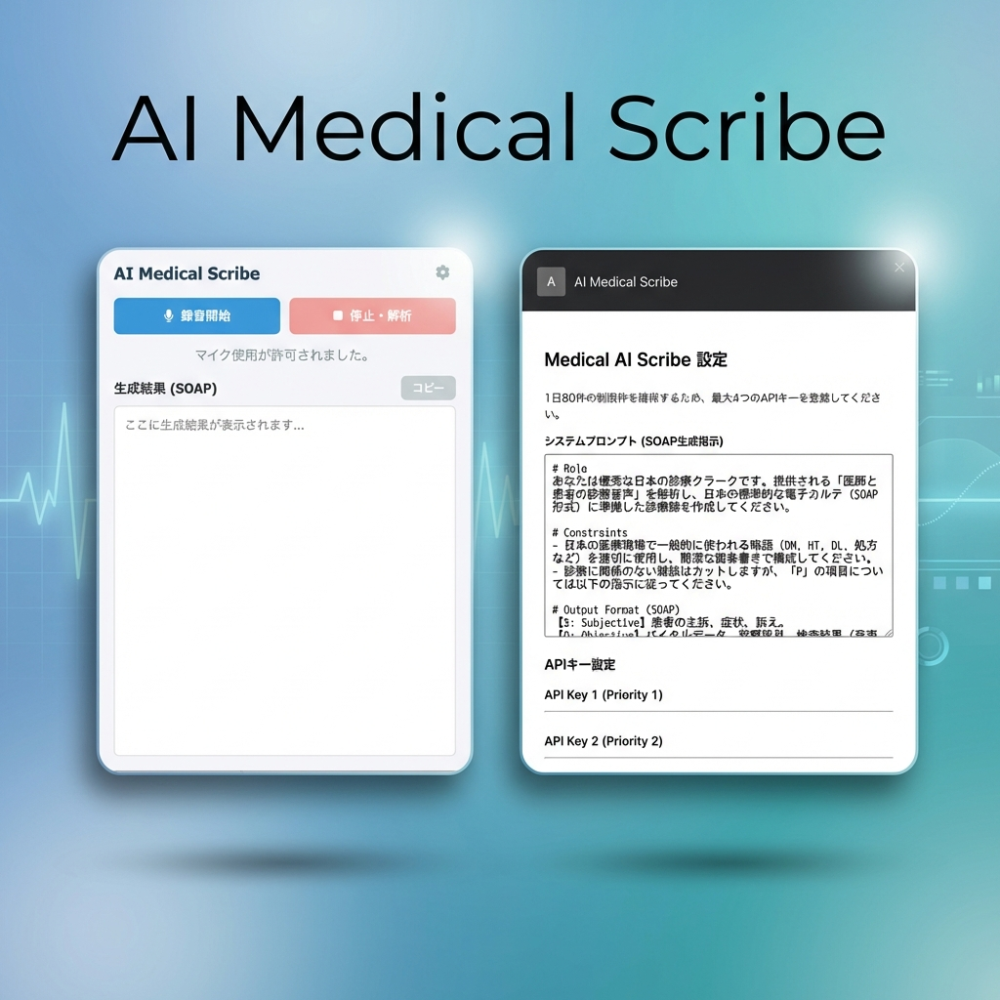

# 🏥 AI Medical Scribe (医療用AIスクライブ)

【重要】本ツール利用に関する同意事項・免責事項（必ずお読みください）
本ツールは、厚生労働省「[医療情報システムの安全管理に関するガイドライン 6.0版](https://www.mhlw.go.jp/stf/shingi/0000516275_00006.html)」および「医療領域における生成AIの利用に関する暫定的な考え方」に準拠した運用を前提としています（2026年2月現在）。利用者は、本ツールの利用にあたり、以下の事項を完全に理解し、同意したものとみなされます。

### 1. Google Gemini APIとの契約およびデータ保護について
- **契約主体**: 本ツールは利用者自身のAPIキーを使用して動作します。Googleとの利用契約および発生する料金の支払いは、利用者個人の責任となります。
- **有料設定の義務**: 医療情報を入力する場合、必ず **Google AI Studio で 「Pay-as-you-go（従量課金）」 にアップグレードしたAPIキー**、または **Google Cloud（Vertex AI）のAPIキー** を使用してください。
- **無料枠利用の禁止**: 無料枠（Free tier）のAPIキーは、入力データがGoogleのモデル改善（学習）に利用されるため、患者の個人情報および診察内容の入力は厳禁です。これに違反して生じた情報漏洩について、開発者は一切の責任を負いません。

### 2. 生成データの正確性とハルシネーションについて
- **AIの特性**: 生成AIは、**実在しない診察内容、検査数値、処方内容を「もっともらしく」生成（ハルシネーション）**するリスクがあります。
- **最終確認の義務**: 生成されたテキストをそのままカルテ等に転記することは避けてください。厚生労働省の指針に基づき、必ず医師本人が内容の正確性を確認・修正した上で、自らの責任において使用してください。

### 3. データ保存とセキュリティ
- **ゼロ・データ・レテンション**: 録音データおよび生成されたテキストが、開発者のサーバーに送信・保存されることはありません。データはブラウザから直接Google APIへ送信されます。
- **ローカル管理**: APIキーはブラウザのローカルストレージにのみ保存されます。端末の紛失やウイルス感染によるキーの流出には十分注意してください。

### 4. 免責事項（法的責任の限定）
- 本ツールは「現状有姿」で提供されるオープンソース・ソフトウェアであり、動作の保証、および個別サポートは行いません。
- 本ツールの利用により生じた誤診、医療事故、情報漏洩、その他の損害について、開発者（著者）は理由の如何を問わず、直接的・間接的を問わず一切の法的責任を負いません。

---

**「医師が患者と向き合う時間を最大化する」**

AI Medical Scribeは、診察中の会話音声をAIがリアルタイムに解析し、電子カルテにそのまま貼り付け可能な**SOAP形式**の診療録を自動生成する Chrome 拡張機能です。

---

## 📺 スクリーンショット

## 🚀 プロジェクトのビジョン
日本の医療現場は、過度なカルテ入力業務によって圧迫されています。
患者さんと目を合わせて話したいのに、画面に向かわざるを得ない——。
このプロジェクトは、最新の生成AIを活用して「書く」負担をゼロに近づけ、医師が本来の「診る」ことに集中できる環境を、現場主導のオープンソースで作っていくことを目的としています。

## ✨ 主な機能
- **高精度なSOAP生成**: 日本の医療慣習・医学用語を理解し、整理された診療録を書きます。
- **パーソナル・コンテキスト抽出**: 診察の主目的以外で語られた「患者さんの背景（家族、趣味、価値観）」を抽出し、信頼関係の維持を助けます。
- **APIキー・ローテーション**: Gemini APIの無料枠を効率的に活用するため、複数のキーを自動で切り替え可能です。
- **完全カスタマイズ可能なプロンプト**: 診療科（内科、精神科、整形外科など）や個人の好みに合わせて、出力スタイルを自由に変更できます。
- **多言語対応**: 日本語をベースに、必要に応じて英語等への対応も技術的に可能です。

## 🛡️ セキュリティとプライバシー（医療機関向け）
医療情報を扱う上で、プライバシー保護は最優先事項です。
- **サーバーレス設計**: 音声データや解析結果を保存する中間サーバーは存在しません。
- **データ破棄**: ブラウザを閉じるとメモリ上のデータはすべて消去されます。
- **直接通信**: データはあなたのブラウザから Google Gemini API へ直接送信されます。
- **透明性**: すべてのコードはオープンソースであり、誰でも安全性を検証可能です。

## � インストール方法
現在、開発者向けに公開しています。
1. 本リポジトリの [Releases](https://github.com/tomom87/clinic-soap-assistant-jp/releases) から最新のZIPをダウンロード。
2. ZIPを解凍する。
3. Chromeブラウザで `chrome://extensions/` を開く。
4. 右上の「デベロッパー モード」をONにする。
5. 「パッケージ化されていない拡張機能を読み込む」ボタンを押し、解凍したフォルダを選択。

## � 使い方
1. 拡張機能のアイコンをクリックしてポップアップを開く。
2. 「設定」アイコンから、自身の Gemini API キーを登録（[Google AI Studio](https://aistudio.google.com/) で無料で取得可能）。
3. 診察開始時に「録音開始」をクリック。
4. 終了後に「停止・解析」をクリックすると、SOAP形式のテキストが生成されます。

## 🗺️ ロードマップ (今後の開発予定)
- [ ] 🎨 **UI/UXの向上**: 診察室のPC環境でより邪魔にならないデザインへ。
- [ ] 🗣️ **特定用語への最適化**: 診療科ごとの専門用語への対応強化。
- [ ] 🗄️ **オフライン対応**: ローカルで動作するLLM（Gemma, Llama等）への対応検討。
- [ ] 📝 **フォーマット拡充**: 紹介状作成支援、退院サマリー作成支援。

## 🤝 貢献者を募集中！
エンジニア、医師、看護師、医療事務、デザイナーなど、あらゆる立場からの貢献を歓迎します。
- **医師の方**: 「こんな出力が欲しい」というプロンプトのアイデア。
- **開発者の方**: コードの最適化、バグ修正、新機能の提案。

詳細は [CONTRIBUTING.md](CONTRIBUTING.md) をご覧ください。

---

## 📝 免責事項
本ツールは診療補助を目的としたものであり、診断や治療の決定を行うものではありません。生成された内容は必ず医師本人が最終確認し、必要に応じて修正してください。

---
*「テクノロジーで、医療をもっと人間らしく。」*
[GitHub Issues](https://github.com/tomom87/clinic-soap-assistant-jp/issues) でのフィードバックをお待ちしています。
