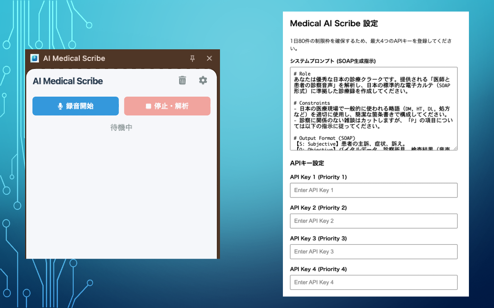

# 🏥 AI Medical Scribe (医療用AIスクライブ)

【重要】本ツール利用に関する同意事項・免責事項（必ずお読みください）
本ツールは、厚生労働省「[医療情報システムの安全管理に関するガイドライン 6.0版](https://www.mhlw.go.jp/stf/shingi/0000516275_00006.html)」および「医療領域における生成AIの利用に関する暫定的な考え方」に準拠した運用を前提としています（2026年2月現在）。利用者は、本ツールの利用にあたり、以下の事項を完全に理解し、同意したものとみなされます。

### 1. Google Gemini APIとの契約およびデータ保護について
- **Google Cloud (Vertex AI) の推奨**: 厚生労働省のガイドライン（3省2ガイドライン）を厳密に遵守し、Google社と法人として「データ保護契約（CDPA）」を締結して運用するには、Vertex AIへの接続が強く推奨されます。これら**アカウント設定、プロジェクト管理、Googleとの契約締結は利用者の責任**となります。
- **有料設定の義務**: 医療情報を入力する場合、必ず **Google AI Studio で 「Pay-as-you-go（従量課金）」 にアップグレードしたAPIキー**、または **Google Cloud (Vertex AI)** を使用してください。
- **無料枠利用の禁止**: 無料枠（Free tier）のAPIキーは、入力データがGoogleのモデル改善（学習）に利用されるため、患者の個人情報および診察内容の入力は厳禁です。

### 2. 生成データの正確性とハルシネーションについて
- **AIの特性**: 生成AIは、**実在しない診察内容、検査数値、処方内容を「もっともらしく」生成（ハルシネーション）**するリスクがあります。
- **最終確認の義務**: 生成されたテキストをそのままカルテ等に転記することは避けてください。厚生労働省の指針に基づき、必ず医師本人が内容の正確性を確認・修正した上で、自らの責任において使用してください。

### 3. データ保存とセキュリティ
- **ゼロ・データ・レテンション**: 録音データおよび生成されたテキストが、開発者のサーバーに送信・保存されることはありません。データはブラウザから直接Google APIへ送信されます。
- **ローカル管理**: APIキーはブラウザのローカルストレージにのみ保存されます。端末の紛失やウイルス感染によるキーの流出には十分注意してください。

### 4. 免責事項（法的責任の限定）
- 本ツールは「現状有姿」で提供されるオープンソース・ソフトウェアであり、動作の保証、および個別サポートは行いません。
- 本ツールの利用により生じた誤診、医療事故、情報漏洩、その他の損害について、開発者（著者）は理由の如何を問わず、直接的・間接的を問わず一切の法的責任を負いません。

---

**「医師が患者と向き合う時間を最大化する」**

AI Medical Scribeは、診察中の会話音声をAIがリアルタイムに解析し、電子カルテにそのまま貼り付け可能な**SOAP形式**の診療録を自動生成する Chrome 拡張機能です。

---

## 📺 スクリーンショット

## 🚀 プロジェクトのビジョン
... (省略) ...

## ✨ 主な機能
- **高精度なSOAP生成**: 日本の医療慣習・医学用語を理解し、整理された診療録を書きます。
- **マルチタスク並列解析 (v1.2)**: 解析待ちの間に次の録音を開始でき、診察の手を止めません。
- **履歴・自動保存 (v1.2)**: 生成されたSOAPを最大100件まで自動保存。いつでも見返し・コピーが可能です。
- **パーソナル・コンテキスト抽出**: ...

## 🛡️ セキュリティとプライバシー...

## 📦 インストール方法...

## 📖 使い方...

## 📋 変更履歴

### v1.3.2 (2026-03-19)
- クリップボード書込の成否をoffscreenドキュメントから正しく返すように修正
- バックグラウンド通信のリトライを通信エラー時のみに限定
- 自動コピー処理のエラーハンドリングを改善（await漏れ修正）
- 手動コピーボタンにoffscreen経由のフォールバックを追加

### v1.3.1 (2026-03-19)
- offscreenドキュメント作成時のエラーハンドリング追加（try/catch/finally）
- offscreenへのメッセージ送信にリトライロジック追加
- クリップボード書込をnavigator.clipboard API優先に変更

### v1.3.0 (2026-03-06)
- Gemini 3.1 Flash Lite Preview に対応
- エラーハンドリングの改善

### v1.2 (2026-02-10)
- マルチタスク並列解析: 解析中に次の録音を開始可能
- 履歴・自動保存: 最大100件まで自動保存
- サイドパネルUI

## 🗺️ ロードマップ (今後の開発予定)
- [x] 🎨 **UI/UXの向上**: サイドパネル化とレスポンシブなカードUIを実装。
- [x] 💾 **自動保存機能**: ブラウザローカルストレージへの永続化。
- [ ] 🔐 **Vertex AI 対応**: 3省2ガイドライン遵守のためのエンタープライズ向け接続モードの実装。
- [ ] 🗣️ **特定用語への最適化**: 診療科ごとの専門用語への対応強化。
- [ ] 🗄️ **オフライン対応**: ローカルで動作するLLM（Gemma, Llama等）への対応検討。

## 🤝 貢献者を募集中！
エンジニア、医師、看護師、医療事務、デザイナーなど、あらゆる立場からの貢献を歓迎します。
- **医師の方**: 「こんな出力が欲しい」というプロンプトのアイデア。
- **開発者の方**: コードの最適化、バグ修正、新機能の提案。

詳細は [CONTRIBUTING.md](CONTRIBUTING.md) をご覧ください。

---

## 📝 免責事項
本ツールは診療補助を目的としたものであり、診断や治療の決定を行うものではありません。生成された内容は必ず医師本人が最終確認し、必要に応じて修正してください。

---
*「テクノロジーで、医療をもっと人間らしく。」*
[GitHub Issues](https://github.com/tomom87/clinic-soap-assistant-jp/issues) でのフィードバックをお待ちしています。
